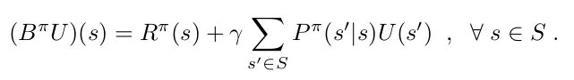
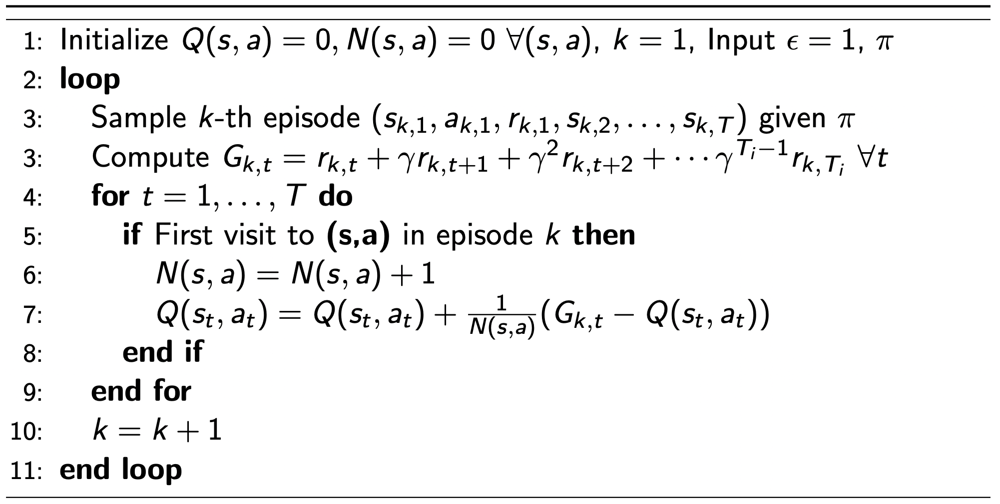
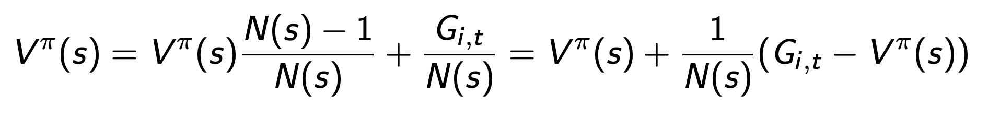
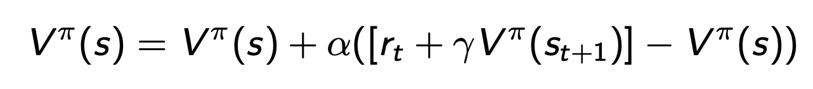
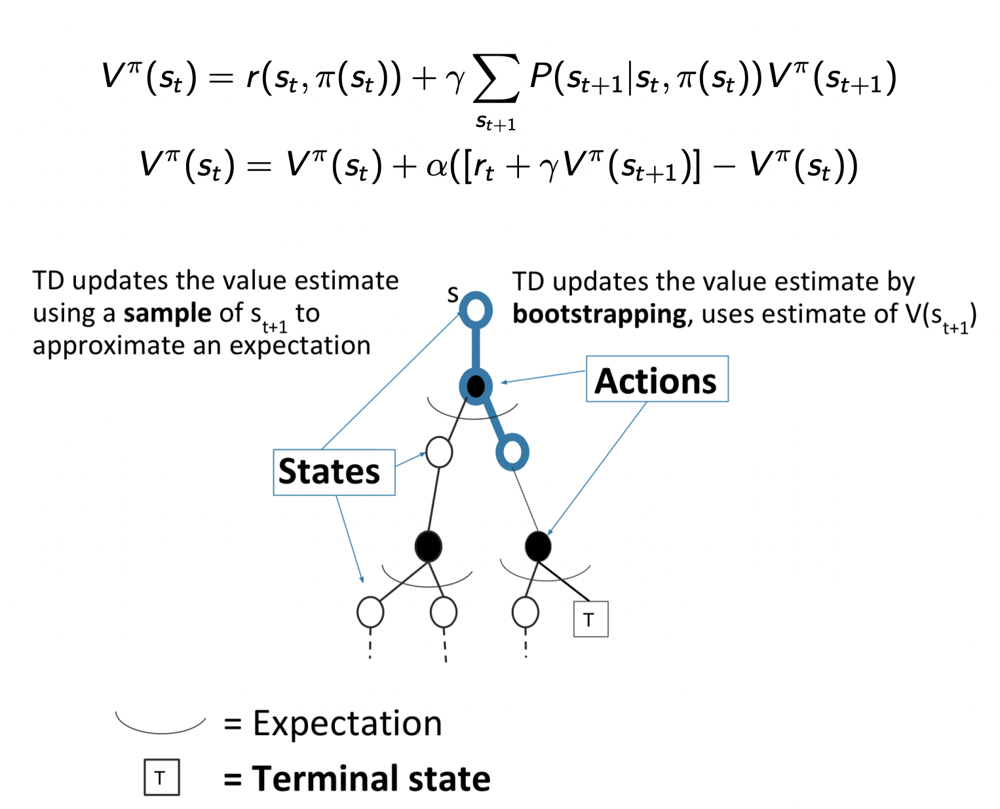
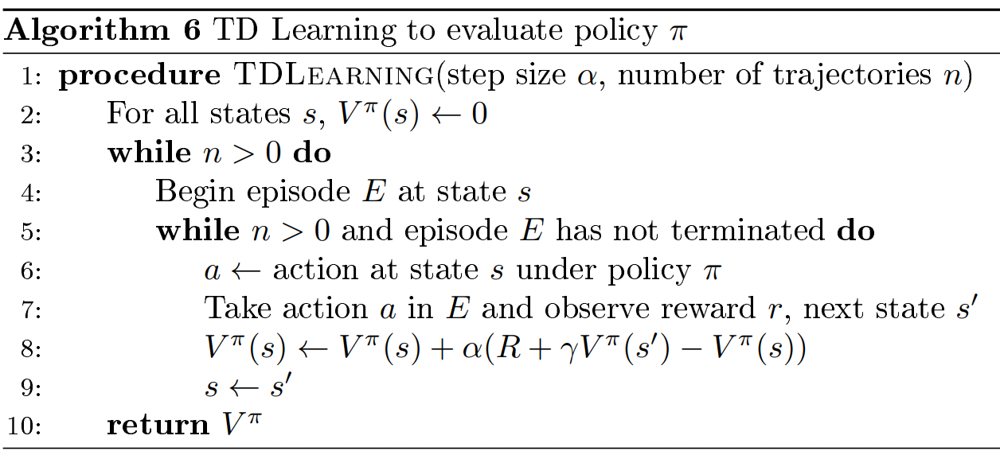
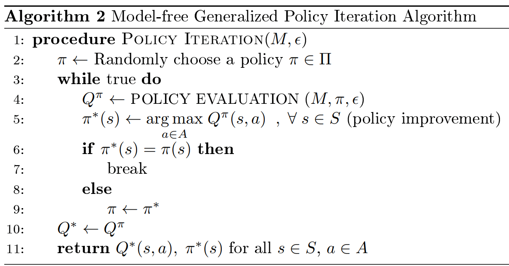
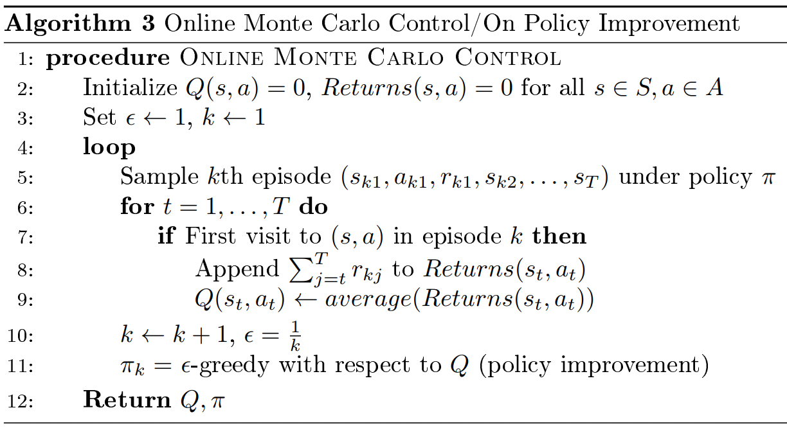

In model-free control, it is difficult or even impossible to estimate the transition dynamics of the environment. Therefore, we need to modify our current algorithms (Policy & Value iteration) so that they do not make use of the transition dynamics.

## __1. Policy Evaluation__
If we are given the dynamics of the environment, then the standard algorithm to evaluate how good our current policy is to directly estimate the value for each states given the policy until convergence by the bellman equation: 

Without the transition model, one approach we can think of is estimating the values of states via simulations.

### *1.1 Monte Carlo Policy Evaluation*

We can also modify above algorithm so that we can estimate the values of state-action pairs.

We can write the formula to update $V^{\pi}(s)$ in an incremental form:

Replacing $\frac {1}{N(s)}$ with $\alpha$ as the learning rate, we get the formula:

There are some key limitations with Monte Carlo Policy Evaluation:

<ul>
    <li> High variance: Estimates depend on a random sample of episodes, and the sample may not be representative of the true distribution of episodes. </li>
    <li> Computtional complexity: Cannot work well with large state spaces or when real-time processing is required </li>
    <li> No guarantee of convergence </li>
</ul>

### *1.2 Temporal Difference Policy Evaluation*
TDLearning is a combination of Monte Carlo & dynamic programming methods. It is model-free and can immediately update estimates of V after each (s, a, r, s') tuple.
From above, we have the update formula:

To execute the update, we need to have the full roll-out of an episode to estimate the return value $G_{i,t}$. However, instead of executing the full episode, we can estimate the value of $G_{i,t}$ by the bellman backup operator:

__Pseudocode for TDLearning__

## __2. Policy improvement__

### *2.1 Online Monte Carlo Control*
In order for our policy iteration to work entirely on model-free problems, we also need policy improvement algorithms that assume no knowledge about the model of the environment. The current policy improvement step is:

$\pi^{*} \leftarrow \underset{a \in A}{argmax} \left(R(s,a) + \gamma \sum_{s' \in S} P(s' \mid s,a) V^{\pi}(s')\right); \forall s \in S$

To get rid of transition probability P, we can make use of state-action values:

### *2.2 $\epsilon$-greedy policy for exploration*
One problem with Monte-Carlo approach is that the current policy may ignore suboptimal actions that may yield higher long-term expected rewards. Therefore, to encourage exploration, one simple approach is to add some randomness into the process of choosing actions of the policy:

## __3. Model-free control algorithms__
With model-free policy evaluation and policy improvement algorithms, we can now discuss some model-free control algorithms.

### *3.1 Monte carlo control*

### *3.2 Temporal Difference Methods for Control*

